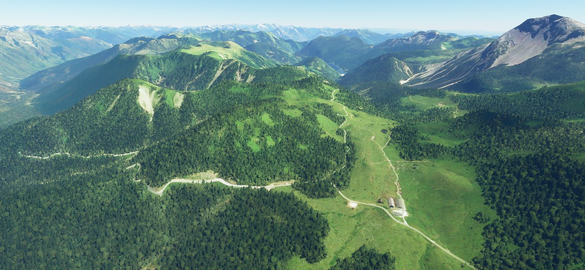
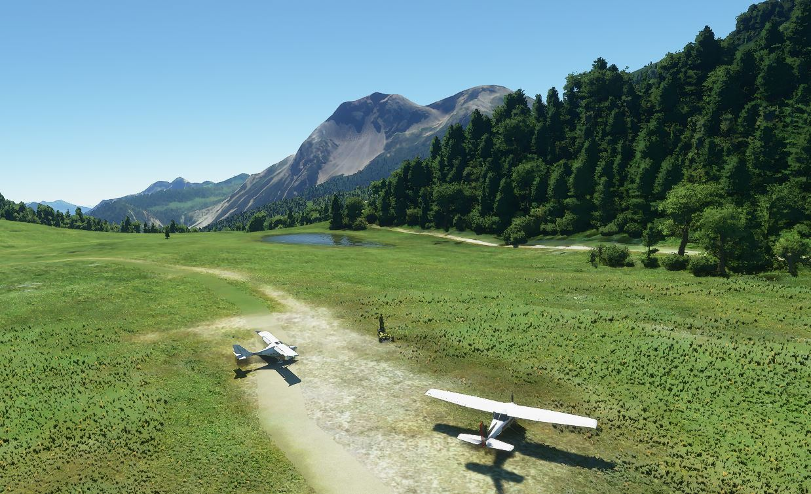
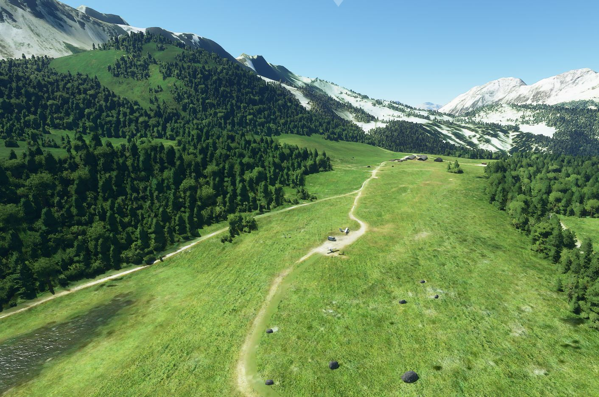
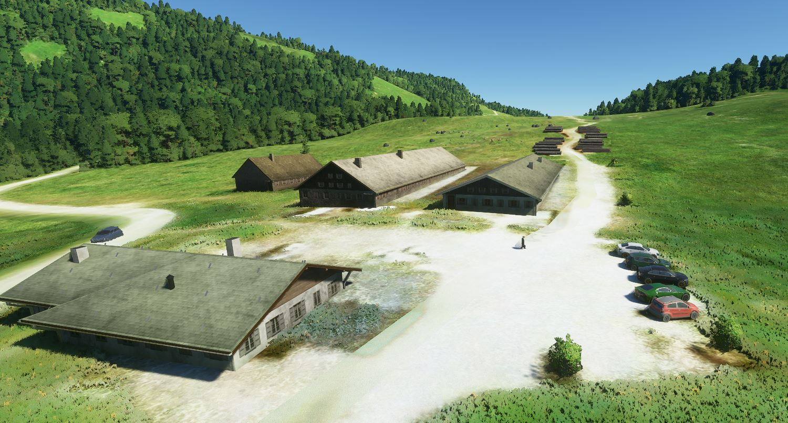
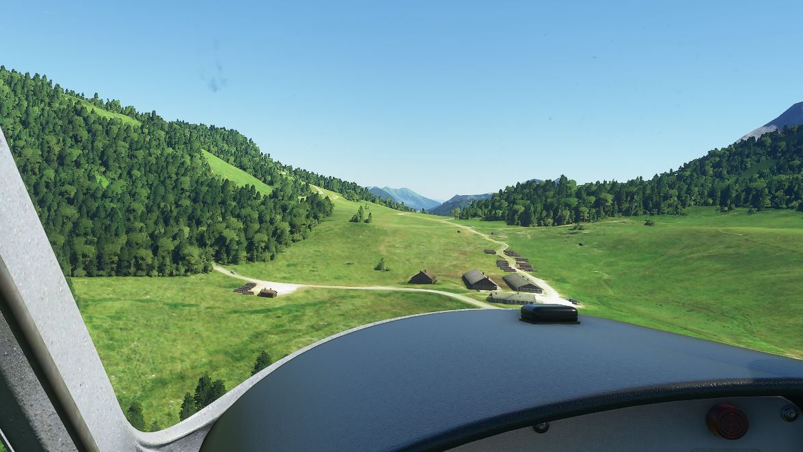

# Casera Razzo Alpine Landing Strip for MSFS 2020
Altitude Airstrip Casera Razzo in the Italien Alps for Microsoft Flight Simulator 2020.
It is a non official gras runway in the Dolomiti mountains (Vento region) situated on a pass.  With the elevation of about 1.800m abouve sea level it might be the highest availible landing in Italy. The short strip with 400m length makes it only suitable for small aircraft.  Forced to give an ICAO code, which does not exist in reality, I chose "LID1".

Actually the mesh and scenery in MSFS are per default great and usable for this small strip. So you could fly there directly e.g. from Belluno (LIDB) or enter the following coordinates: **46.477098, 12.614290**. This scenery however adds a runway, so that you could spawn there directly and it adds some further objects.

## Installation
[DOWNLOAD](https://github.com/nofaceinbook/msfs2020-airport-CaseraRazzo/releases) the airport file of the latest release and unzip it into your MSFS 2020 Community Folder. 

## More Pictures

## Credits
I was inspired by nicotom-xp who created [this nice landing strip in X-Plane](https://forums.x-plane.org/index.php?/files/file/24728-casera-razzo-mountain-landing-strip-italy/) and he based it on a scenery started from the original FSX work by Dario "Vic Dabor" Bortot. So now it is back again in the newest MS sim :-)

